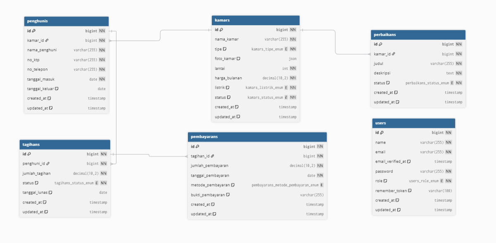

# PERANCANGAN BASIS DATA (DATABASE)

Dalam pengembangan Website UP-Resident, perancangan basis data memegang peranan vital untuk memastikan integritas dan relasi antar data. Berikut adalah skema *Entity Relationship Diagram* (ERD) yang digunakan.

---

## A. ENTITY RELATIONSHIP DIAGRAM (ERD)

Diagram berikut menggambarkan relasi antar entitas dalam sistem, mulai dari entitas master (Users, Kamars) hingga entitas transaksional (Tagihan, Pembayaran).

  
   
  
<b>Gambar 3.1: Skema Relasi Database UP-Resident</b>

---

## B. SPESIFIKASI TABEL DAN RELASI

Berdasarkan diagram di atas, berikut adalah penjelasan detail mengenai fungsi setiap tabel dan relasinya:

### 1. Tabel Master (Data Utama)

| Nama Tabel | Deskripsi Fungsi | Relasi Utama |
| :--- | :--- | :--- |
| **users** | Menyimpan data akun pengguna sistem (Admin & Staff) untuk keperluan autentikasi (*login*). | Tidak memiliki *Foreign Key* (Berdiri sendiri). |
| **kamars** | Menyimpan data inventaris kamar kos, termasuk status ketersediaan, fasilitas (AC/Non-AC), harga bulanan, dan posisi lantai. | *Parent* dari tabel `penghunis` dan `perbaikans`. |
| **penghunis** | Menyimpan biodata lengkap penyewa kos yang sedang aktif. | Terhubung ke `kamars` (One-to-Many), karena satu kamar dihuni oleh satu penghuni pada satu waktu. |

### 2. Tabel Transaksi (Keuangan)

| Nama Tabel | Deskripsi Fungsi | Relasi Utama |
| :--- | :--- | :--- |
| **tagihans** | Mencatat kewajiban pembayaran yang harus dilunasi penghuni setiap bulannya. | Terhubung ke `penghunis` (One-to-Many), satu penghuni bisa memiliki banyak riwayat tagihan. |
| **pembayarans** | Mencatat bukti transaksi pembayaran yang dilakukan penghuni (Log Cashflow). | Terhubung ke `tagihans` (One-to-One/Many), setiap pembayaran merujuk pada tagihan tertentu. |

### 3. Tabel Operasional (Maintenance)

| Nama Tabel | Deskripsi Fungsi | Relasi Utama |
| :--- | :--- | :--- |
| **perbaikans** | Mencatat riwayat keluhan atau kerusakan fasilitas kamar yang dilaporkan. | Terhubung ke `kamars` (One-to-Many), satu kamar bisa memiliki banyak riwayat perbaikan. |

---

## C. ALUR RELASI DATA (FLOW)

1.  **Penyewaan:** Saat ada penyewa baru, data dimasukkan ke tabel `penghunis` dan dikaitkan dengan `kamars_id` yang dipilih.
2.  **Penagihan:** Sistem akan membuat data di tabel `tagihans` berdasarkan data `penghunis` yang aktif.
3.  **Pembayaran:** Saat admin menerima uang, data dicatat di tabel `pembayarans` yang mengacu pada ID `tagihans` terkait, sehingga status tagihan berubah menjadi *Lunas*.

---

[⬅️ Kembali ke Halaman Utama](../README.md)
