#  IMPLEMENTASI DAN FITUR APLIKASI

Bab ini menjelaskan pembagian tugas tim pengembang serta dokumentasi lengkap fitur-fitur yang telah berhasil diimplementasikan dalam aplikasi UP-Resident, mencakup sisi Pengunjung (Guest) dan sisi Administrator.

---

## A. PEMBAGIAN TUGAS TIM (JOB DESK)

Berdasarkan *Log History* pengembangan, berikut adalah rincian tanggung jawab setiap anggota tim:

| Nama Anggota | Role / Fokus Pengerjaan | Deskripsi Tugas |
| :--- | :--- | :--- |
| **Naufal** | *Fullstack Developer* | • Membuat Database Migrations • Mengatur Filament Resources & Seeders • Integrasi Payment Gateway (Midtrans)|
| **Shafiq** | *Backend Engineer* | • Mengembangkan Fitur Login/Auth • Mengelola Logika Tagihan/Billing |
| **Ihsan** | *Frontend & Data Logic* | • Mengelola Data Penghuni • Mengembangkan Dashboard sisi User |
| **Hardy** | *UI/UX Designer* | • Mengatur Tampilan User Interface (Landing Page) • Kustomisasi Komponen & Status Badges |
| **Arya** | *Technical Writer* | • Menyusun Dokumentasi Proyek • Menyusun Laporan Markdown |

---

## B. FITUR AKSES PUBLIK (FRONTEND)

Fitur ini dapat diakses oleh siapa saja (pengunjung umum) tanpa perlu login terlebih dahulu, bertujuan untuk promosi dan informasi ketersediaan kamar.

### 1. Halaman Utama (Landing Page)
Halaman depan yang menyambut pengunjung dengan desain modern, menampilkan slogan "Temukan Kos Impian Anda" dan navigasi utama.

  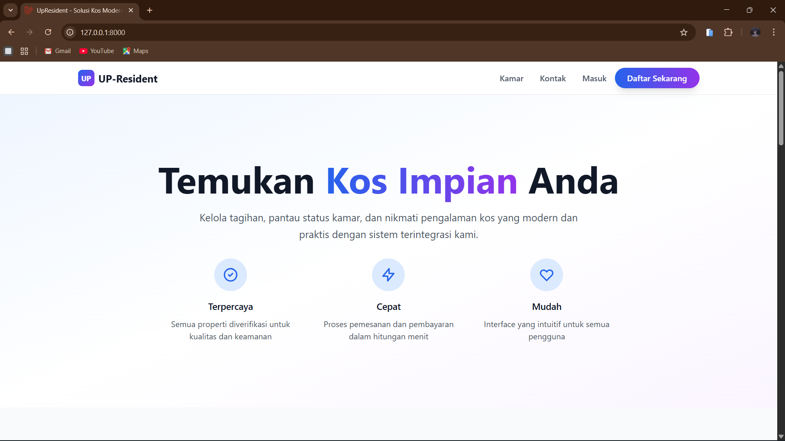
   
  
<b>Gambar : Hero Section Landing Page</b>

### 2. Informasi Keunggulan
Bagian yang menjelaskan fasilitas dan alasan mengapa calon penghuni harus memilih UP-Resident (Pembayaran Otomatis, Manajemen Kamar, Responsif).

  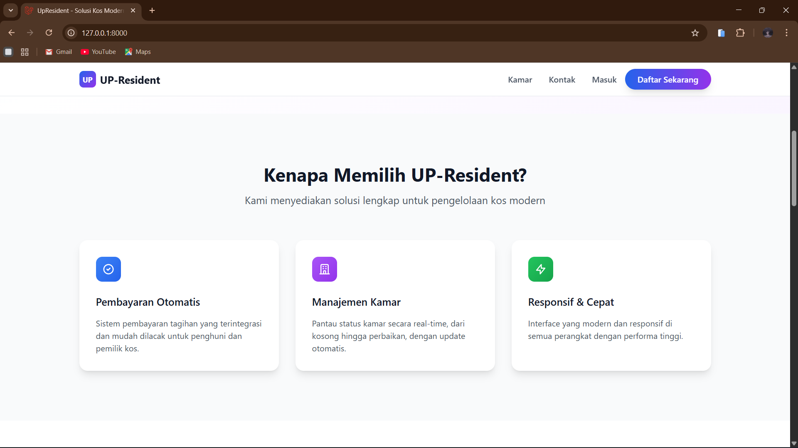
   
  
<b>Gambar : Bagian Fitur & Keunggulan</b>

### 3. Katalog Ketersediaan Kamar
Fitur pencarian yang memungkinkan pengunjung melihat daftar kamar, filter berdasarkan tipe (AC/Non-AC), status (Kosong/Terisi), dan harga.

  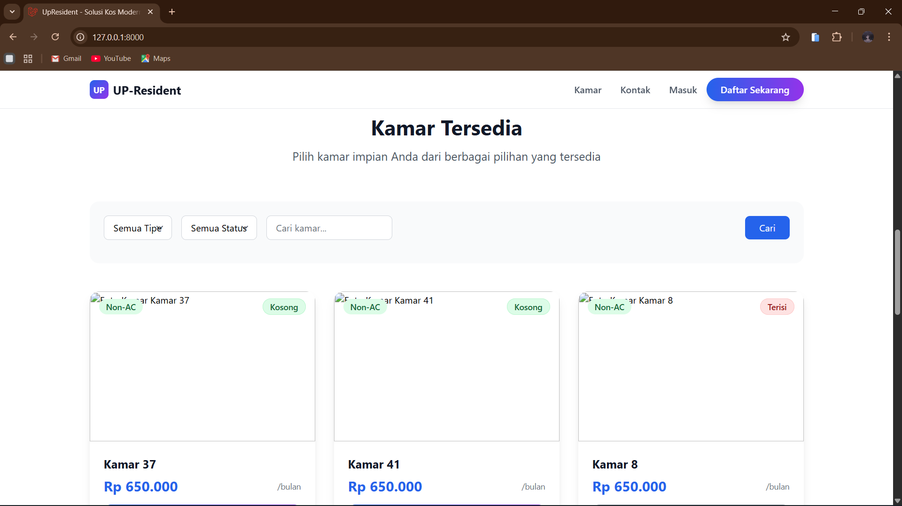
   
  
<b>Gambar : Katalog Pencarian Kamar</b>

### 4. Detail Kontak & Footer
Bagian bawah halaman yang menampilkan informasi kontak pengelola dan tautan cepat.

  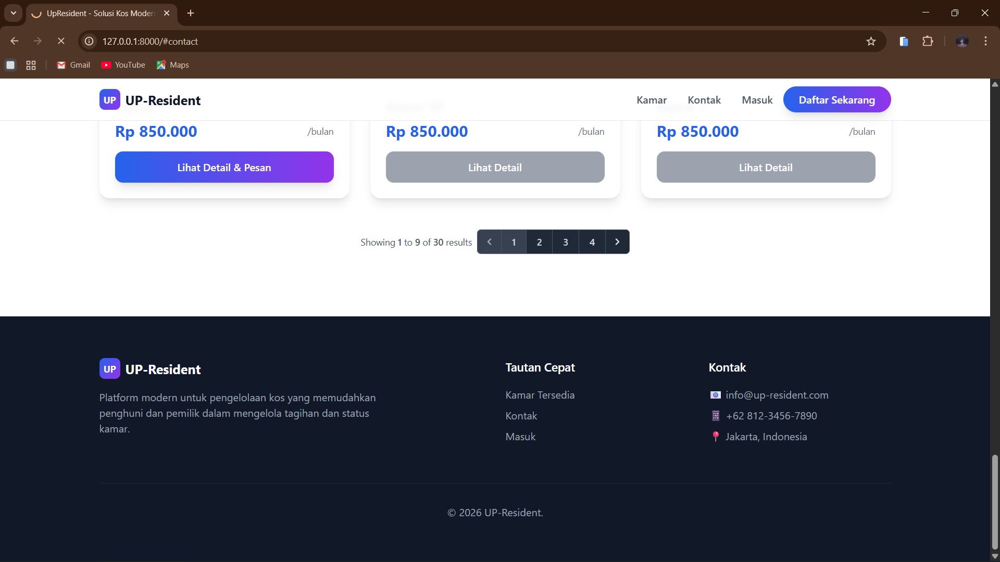
   
  
<b>Gambar : Footer & Informasi Kontak</b>

### 5. Registrasi Penghuni Baru
Formulir pendaftaran untuk calon penghuni baru yang ingin membuat akun untuk menyewa kamar.

  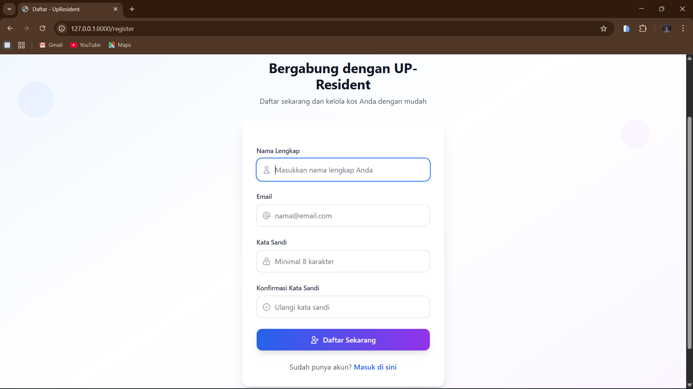
   
  
<b>Gambar : Halaman Registrasi Akun</b>

### 6. Login Sistem
Halaman autentikasi untuk Admin dan Penghuni agar bisa masuk ke dalam dashboard pengelolaan.

  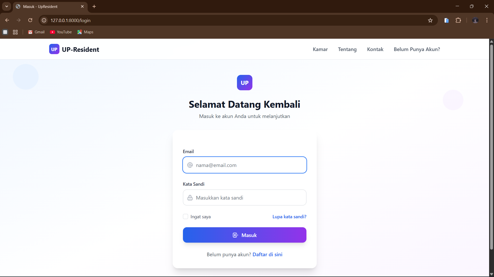
   
  
<b>Gambar : Halaman Login</b>

## C. FITUR MANAJEMEN DATA MASTER (ADMIN BACKEND)

Fitur ini khusus diakses oleh Admin melalui Dashboard Filament untuk mengelola data utama sistem.

### 7. Fitur Manajemen Users
Halaman untuk mengelola akun pengguna sistem, memverifikasi email, dan mengatur hak akses (Role).

  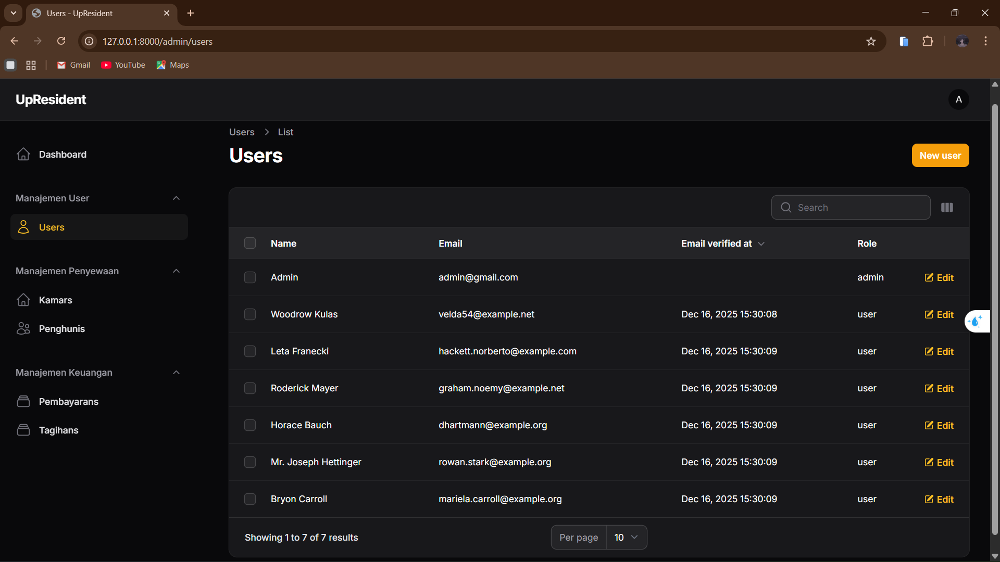
   
  
<b>Gambar : Halaman Manajemen User</b>

### 8. Fitur Manajemen Kamar
Admin dapat mengelola inventaris kamar, mengubah harga bulanan, dan memantau status fasilitas (AC/Listrik).

  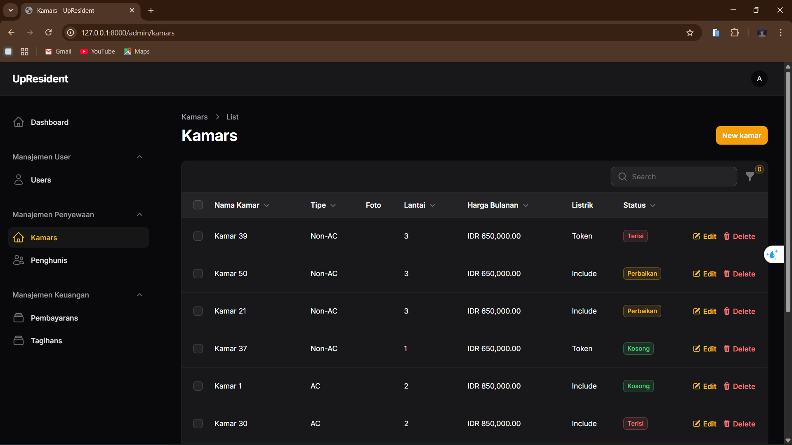
   
  
<b>Gambar : Halaman Daftar Kamar</b>

### 9. Fitur Manajemen Penghuni
Halaman untuk mendata identitas lengkap penyewa yang sedang aktif, termasuk data KTP dan kontak.

  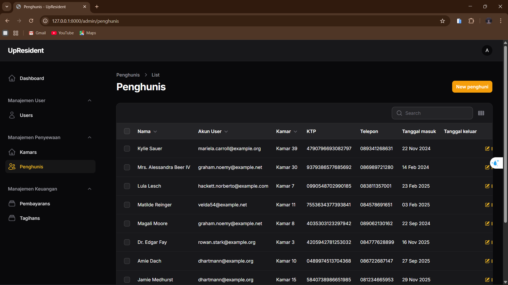
   
  
<b>Gambar : Halaman Data Penghuni</b>

---

## D. FITUR KEUANGAN & TRANSAKSI

Fitur krusial untuk menangani alur pembayaran sewa kos dan pencatatan arus kas.

### 10. Daftar Tagihan (Invoices)
Rekapitulasi tagihan bulanan penghuni dengan status pembayaran (Lunas/Belum Lunas).

  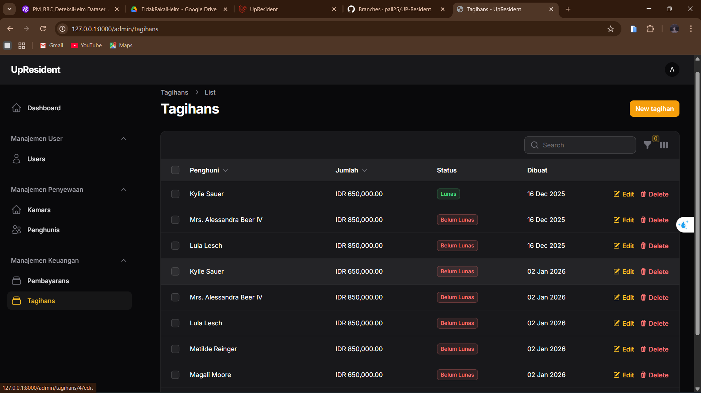
   
  
<b>Gambar : Halaman List Tagihan</b>

### 11. Generate Tagihan Otomatis
Fitur pop-up untuk membuat tagihan bulanan secara otomatis bagi penghuni yang dipilih.

  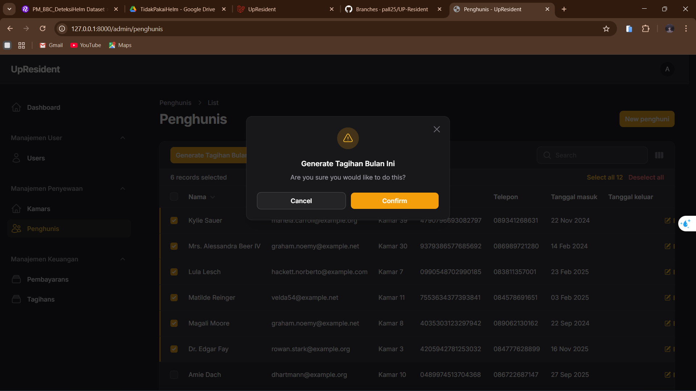
   
  
<b>Gambar : Pop-up Generate Tagihan</b>

### 12. Input & Riwayat Pembayaran
Formulir untuk mencatat pembayaran yang diterima dari penghuni (Cash/Transfer).

      
   
  
<b>Gambar : Form Pembayaran</b>

### 13. Detail Pembayaran
Halaman rincian transaksi yang berfungsi sebagai kuitansi digital.

        
   
  
<b>Gambar : Detail Pembayaran</b>

---

[⬅️ Kembali ke Halaman Utama](../README.md)
