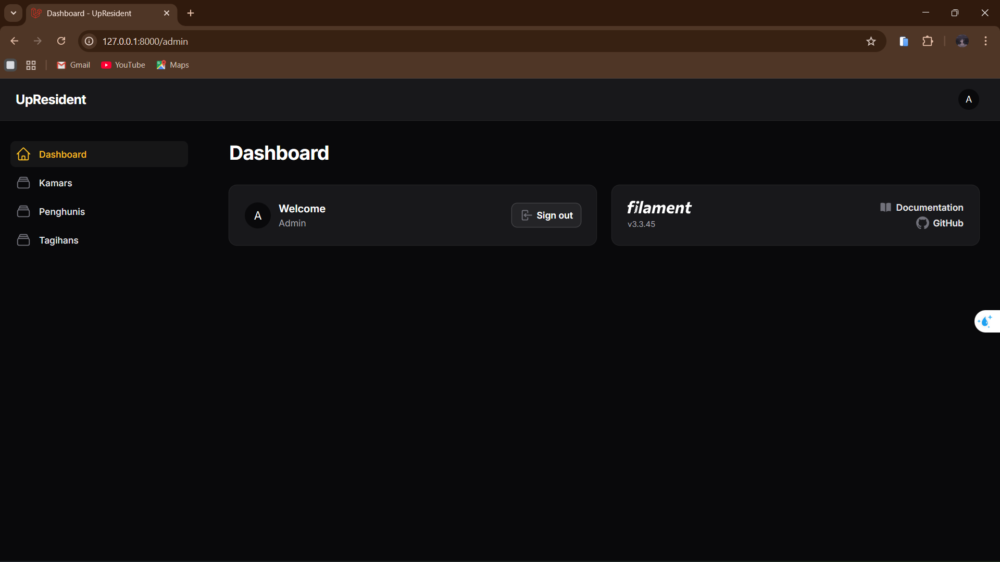
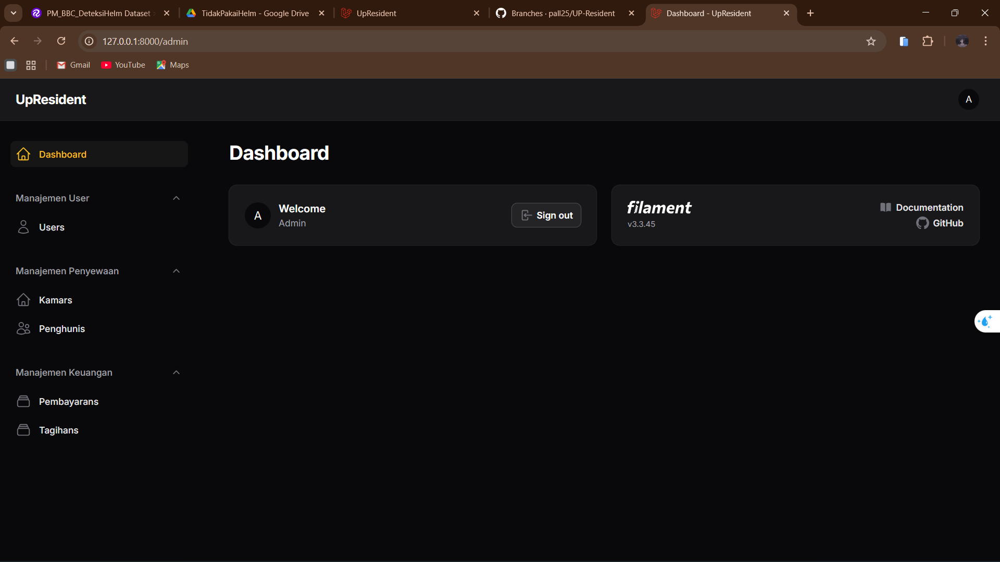
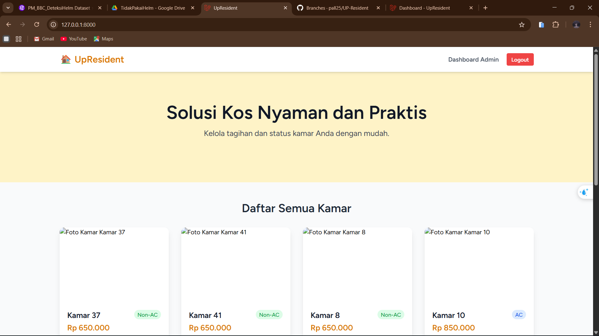

# DOKUMENTASI ANTARMUKA PENGGUNA (UI)

Berikut adalah dokumentasi perkembangan tampilan aplikasi (User Interface) dari tahap awal hingga tahap penyempurnaan (Landing Page).

---

## A. PROGRESS MINGGU KE-1 (Dashboard Awal)
Pada minggu pertama, fokus pengembangan adalah membuat kerangka dasar Dashboard Admin menggunakan Filament. Menu masih ditampilkan apa adanya (flat list).

  
   
  
<b>Gambar : Tampilan Dashboard Admin (Versi Awal)</b>

  
<i>Menu sidebar belum dikelompokkan (Kamars, Penghunis, Tagihans).</i>

---

## B. PROGRESS MINGGU KE-2 (Grouping Sidebar)
Pada minggu kedua, dilakukan perbaikan tampilan (Refactoring). Menu sidebar kini dikelompokkan berdasarkan kategori agar lebih rapi dan mudah diakses oleh Admin.

  
   
  
<b>Gambar : Tampilan Dashboard Admin (Revisi)</b>

  
<i>Menu sudah dikategorikan: Manajemen User, Penyewaan, dan Keuangan.</i>

---

## C. PROGRESS MINGGU KE-3 (Landing Page)
Pada minggu ketiga, pengembangan difokuskan pada halaman depan (Frontend) yang dapat diakses oleh calon penyewa (Guest) untuk melihat daftar kamar yang tersedia.

  
   
  
<b>Gambar : Halaman Landing Page & Katalog Kamar</b>

  
<i>Menampilkan slogan "Solusi Kos Nyaman dan Praktis" serta daftar kamar beserta harga.</i>

---

## D. PROGRESS MINGGU KE-4 (Finalisasi Frontend & Autentikasi)
Pada minggu keempat, pengembangan memasuki tahap akhir untuk sisi pengguna (*User Interface*). Fokus utama adalah mempercantik tampilan *Landing Page* agar terlihat lebih modern dan responsif. Selain itu, fitur krusial seperti **Registrasi Akun** dan **Login Sistem** telah berhasil diintegrasikan, sehingga pengunjung kini dapat mendaftar menjadi calon penghuni secara mandiri.

  
   
  
<b>Gambar : Tampilan Final Landing Page (Hero Section)</b>

  
<i>Desain antarmuka telah disempurnakan dengan slogan yang menarik, navigasi yang jelas, serta tombol akses cepat ke halaman Login dan Daftar.</i>

---

[⬅️ Kembali ke Halaman Utama](../README.md)
